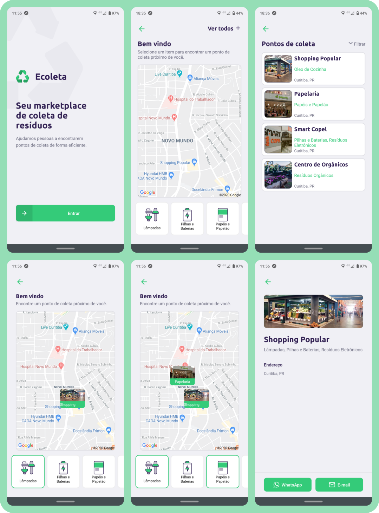

# ecoleta

As "semanas gratuitas" da [Rocketseat](https://rocketseat.com.br/) são eventos onlines que ocorrem cerca três ou quatro vezes ao ano e são realizados ao longo de uma semana. São compostos por aulas, _lives_ e espaços de discussões mediados, principalmente sobre carreiras de Tecnologia. 

O destaque do evento é o curso focado na _stack_ JavaScript em que uma aplicação funcional é desenvolvida do zero. Nessa aplicação é utilizado o NodeJS para contruir o _back_, ReactJS para a versão _web_ e React Native para a _mobile_.

## :recycle: Edição #12 (NLW 1) - Ecoleta
Nesta edição a aplicação é um marketplace para conectar locais especializados em coletar resíduos e pessoas que querem descartá-los de forma adequada.

### :gear: _back-end_

É uma API que atende as versões _web_ e _mobile_, os recursos disponíveis são:

| Verbo | Recurso | Ação | Query params |
|:-:|:-:|-|-|
| GET | `/itens` | Retorna os Itens coletados cadastrados |  |
| GET | `/pontos` | Retorna os Pontos de coleta cadastrados |  |
| GET | `/pontos/:id` | Retorna um Ponto de coleta específico |  |
| POST | `/pontos` | Persiste o registro de um novo Ponto de coleta |  |

### :desktop_computer: _Web_

> https://brnocesar-ecoleta.vercel.app/

A maior parte das funcionalidades está disponível na versão _web_:
- cadastrar um Ponto de coleta
- acessar a lista de todos os Pontos de coletas cadastrados e filtrá-los por Estado e Cidade
- acessar a página de detalhes de um Ponto de coleta

### :iphone: _Mobile_
A versão _mobile_ permite buscar Pontos de coleta de acordo com a posição geográfica do usuário. Abaixo são apresentadas as telas da aplicação:

